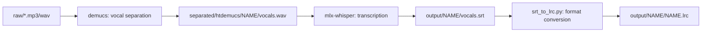

# music2lyrics

Local music-to-lyrics transcription pipeline optimized for M4 Pro Apple Silicon (24GB RAM).

## Architecture



## Directory Structure

- `raw/` — Input audio files (mp3, wav)
- `separated/` — Demucs output (vocal/instrumental separation)
- `output/` — Final transcription output (srt, lrc, txt, vtt, json)
- `.claude/skills/` — Claude Code skill definitions
- `venv/` — Python virtual environment (gitignored)

## Setup

```bash
./setup.sh
```

## Usage

```bash
source venv/bin/activate
./transcribe.sh raw/song.mp3
```

Or with Claude Code skills:
- `/setup` — Install dependencies
- `/transcribe raw/song.mp3` — Transcribe a single file
- `/transcribe raw/song.mp3 en` — Transcribe with custom language

## Dependencies

- Python 3.11+
- ffmpeg
- mlx-whisper (Apple MLX framework, Neural Engine)
- demucs (Meta vocal separation)

## Model Details

- Whisper model: `mlx-community/whisper-large-v3-mlx` (~3GB, cached after first download)
- Demucs model: `htdemucs` (default, ~300MB)

## Performance (M4 Pro, 24GB)

| Step | 3-4 min song |
|---|---|
| Demucs vocal separation | ~30-60 sec |
| mlx-whisper large-v3 | ~20-40 sec |
| Total | ~1-2 min |

Peak RAM usage: ~6-8 GB

## Claude Code Workflow

- Place mp3/wav files in `raw/`
- Run `./transcribe.sh raw/song.mp3` to process a single file
- Output lands in `output/SONG_NAME/` as srt, lrc, txt formats

## Default Language

Default transcription language: `tr` (Turkish). Override with `--language` flag in transcribe.sh.
