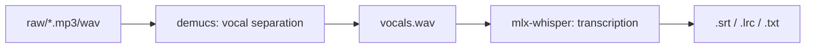

# music2lyrics

Local music-to-lyrics transcription pipeline for Apple Silicon. Extracts vocals with **demucs** and transcribes them with **mlx-whisper** — fully offline, no GPU/CUDA required.



## Requirements

- macOS with Apple Silicon (M1/M2/M3/M4)
- [Homebrew](https://brew.sh)
- Python 3.11+
- ffmpeg

## Setup

```bash
git clone https://github.com/farukcan/music2lyrics.git
cd music2lyrics
./setup.sh
```

This creates a virtual environment and installs:
- [mlx-whisper](https://github.com/ml-explore/mlx-examples/tree/main/whisper) — Whisper on Apple MLX framework (Neural Engine)
- [demucs](https://github.com/adefossez/demucs) — Meta's vocal/instrumental separation model

## Usage

```bash
source venv/bin/activate
./transcribe.sh raw/song.mp3
```

Output is saved to `output/song/` with SRT, LRC, TXT, VTT, and JSON formats.

### Language

Default language is Turkish (`tr`). Pass a second argument to override:

```bash
./transcribe.sh raw/song.mp3 en
```

### SRT to LRC (standalone)

```bash
python srt_to_lrc.py output/song/vocals.srt output/song/song.lrc
```

## Performance (M4 Pro, 24GB)

| Step | 3-4 min song |
|---|---|
| Demucs vocal separation | ~30-60 sec |
| mlx-whisper large-v3 | ~20-40 sec |
| **Total** | **~1-2 min** |

Peak RAM: ~6-8 GB

## Models

| Model | Size | Source |
|---|---|---|
| Whisper large-v3 | ~3 GB | `mlx-community/whisper-large-v3-mlx` |
| htdemucs | ~300 MB | Default demucs model |

Models are downloaded on first run and cached locally.

## License

MIT
